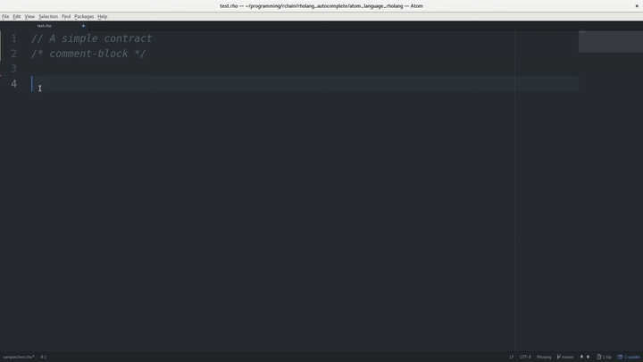

# language-rholang package

https://atom.io/packages/language-rholang

This is the early stage of atom support for [Rholang][rho-github]. :smile:

> **Rholang** is a fully featured, general purpose, Turing-complete programming language built from the rho-calculus. It is a behaviorally typed, **r**-eflective, **h**-igher **o**-rder process language and the official smart contracting language of [RChain][rchain-coop]. Its purpose is to concretize fine-grained, programmatic concurrency. [RChain Architecture][arch-rholang]

Rholang is currently in active development and syntax can slightly change. Current version of the plugin follows this version of [Rho grammar][rho-bnf-origin] and available examples.

Programmers in concurrent languages such as Erlang/Elixir say that one of the hardest problems is to coordinate the names (locations) of processes. It seems that Rholang with [Namespace logic][arch-namespace-logic] looks like a great solution for coordination of resources.

With all this sweet superpowers, that comes with the Rholang compiler and type checker, it will be a pleasure to write smart contracts. :lollipop:

### 0.0.1
- Initial release. Rholang-SDK 0.1 Syntax highlighting, Snippets.

## License

[The MIT License (MIT)][license]

## demo

 

### thanks to [tgrospic](https://github.com/tgrospic) for the awesome grammar

[rchain-coop]: https://www.rchain.coop
[rho-github]: https://github.com/rchain/rchain/tree/master/rholang
[rho-bnf-origin]: https://github.com/rchain/rchain/blob/2710ac95a304afd3840f3c77d72ee37e607dbf53/rholang/src/main/bnfc/rholang.cf
[arch-rholang]: http://rchain-architecture.readthedocs.io/en/latest/contracts/contract-design.html#rholang-a-concurrent-language
[arch-namespace-logic]: http://rchain-architecture.readthedocs.io/en/latest/contracts/namespaces.html#namespace-logic
[tuplespaces-to-picalculus]: http://mobile-process-calculi-for-programming-the-new-blockchain.readthedocs.io/en/latest/actors-tuples-and-pi.html#from-tuplespaces-to-calculus

[license]: https://github.com/flowpoint/atom_language_rholang/blob/master/LICENSE
